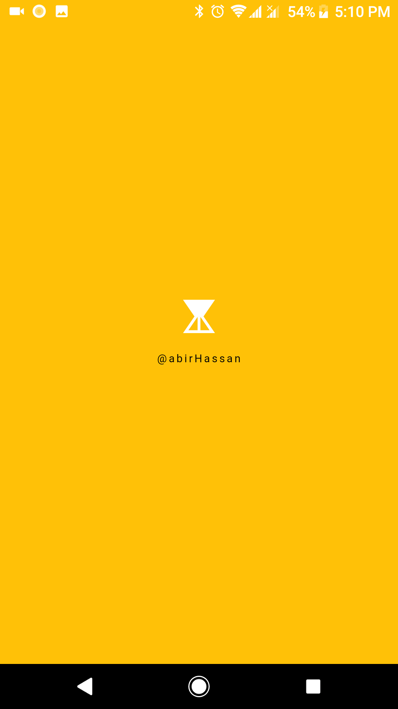
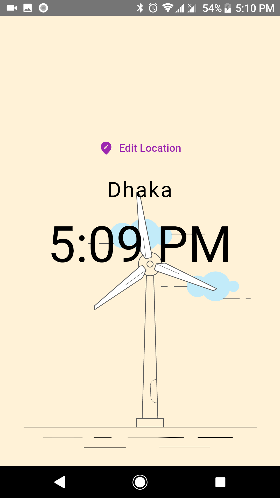
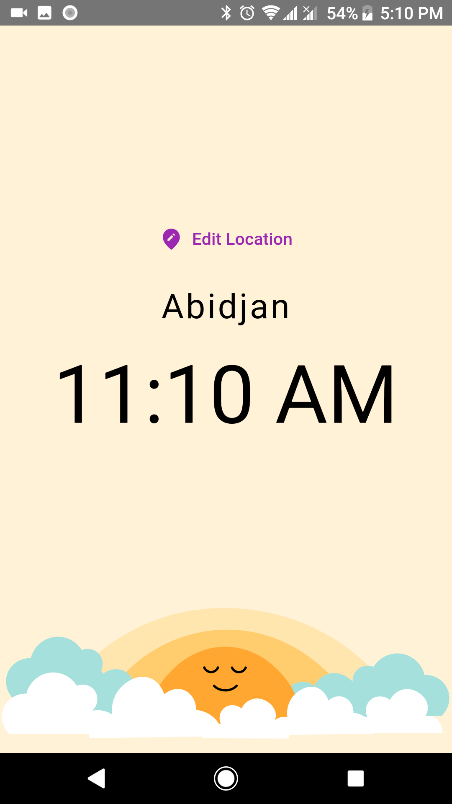
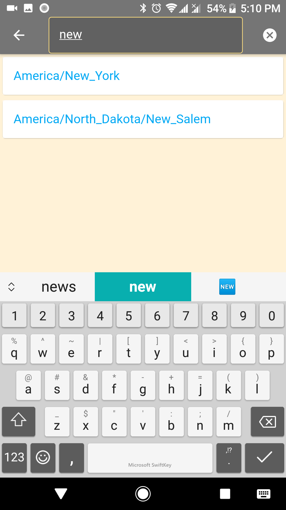
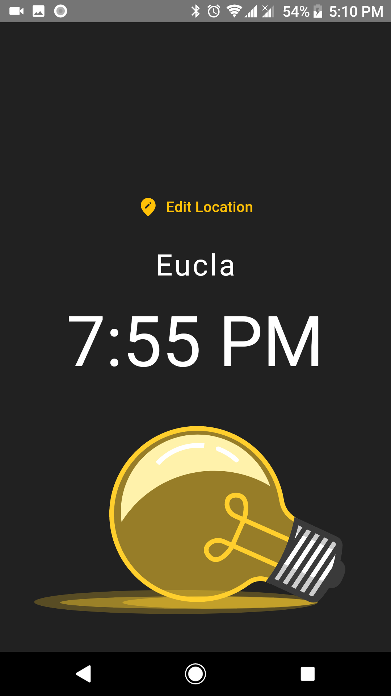

# worldClock
 A flutter app to see world time.
 
This is my 2nd Flutter application. A simple app to see world time. Nothing complicated to use here. Just for learning purpose make this app.
It also includes API integration.

## Project description
Name: worldClock  
Programming Language: Dart  
Platfrom: mobile application  
Project No: update this  
Year: 2021

## Apkfile
* **[worldClock](app file/app-release.apk)**

## Demo Video
<!--  -->

## Screen shot

### Splash Screen

### Time (Evening)

### Morning

### Search

### Night

## Authors

* **AbirHasan**

Check out my other works [@XAbirHasan](https://github.com/XAbirHasan)

